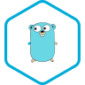

<!-- README.md is generated from README.Rmd. Please edit that file -->

# exercism-solutions

<!-- badges: start -->
<!-- badges: end -->

These are my completed solutions to [Exercism](https://exercism.org/)
problems.

I completed the [\#12in23](https://exercism.org/challenges/12in23)
challenge by solving 5 non-trivial exercises in each of 12 languages,
plus several more.

I am also completing the
[\#48in24](https://exercism.org/challenges/48in24) challenge.

## Number of Exercises per Language

| logo                              | language                                         | exercises |
|:----------------------------------|:-------------------------------------------------|----------:|
|          | <a href="./haskell/">haskell</a>                 |        11 |
|          | <a href="./clojure/">clojure</a>                 |         9 |
|               | <a href="./go/">go</a>                           |         8 |
|            | <a href="./julia/">julia</a>                     |         8 |
|      | <a href="./common-lisp/">common-lisp</a>         |         7 |
|       | <a href="./javascript/">javascript</a>           |         7 |
|           | <a href="./python/">python</a>                   |         7 |
|                | <a href="./r/">r</a>                             |         7 |
|             | <a href="./ruby/">ruby</a>                       |         7 |
|             | <a href="./bash/">bash</a>                       |         6 |
|          | <a href="./fortran/">fortran</a>                 |         6 |
|              | <a href="./lua/">lua</a>                         |         6 |
|            | <a href="./ocaml/">ocaml</a>                     |         6 |
|             | <a href="./rust/">rust</a>                       |         6 |
|            | <a href="./scala/">scala</a>                     |         6 |
|              | <a href="./tcl/">tcl</a>                         |         6 |
|            | <a href="./vlang/">vlang</a>                     |         6 |
|  | <a href="./x86-64-assembly/">x86-64-assembly</a> |         6 |
|              | <a href="./cpp/">cpp</a>                         |         2 |
|             | <a href="./mips/">mips</a>                       |         2 |
|              | <a href="./nim/">nim</a>                         |         2 |

